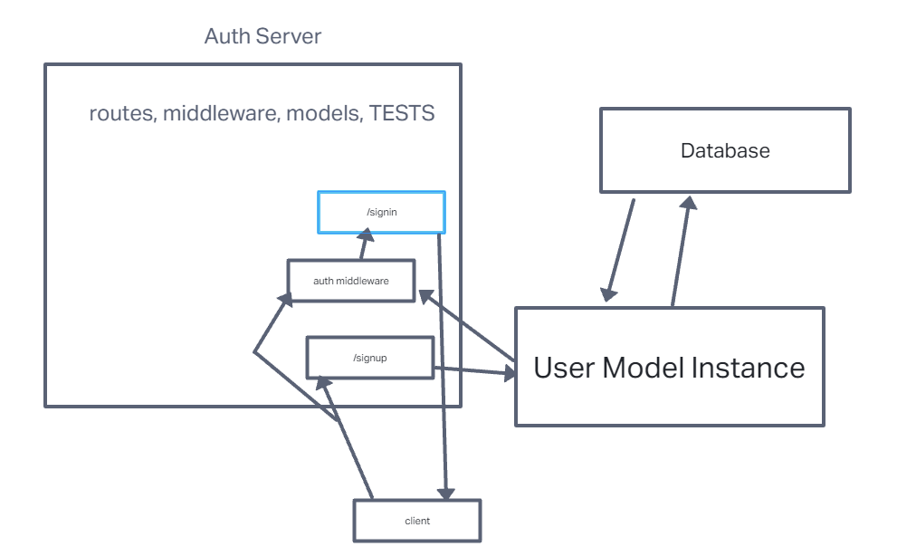

# LAB - 03 / 04

## Project: Basic Authentication Server

### Author: Ike Steoger

### Problem Domain

This is a basic Express server including use of SQL data models using best practices, including server modularization, use of middleware, and tests.

### Links and Resources

- [GitHub Actions ci/cd](https://github.com/IkeSteoger/basic-auth/actions)
<!-- - [back-end dev server url]() -->
- [back-end prod server url](https://basic-auth-97pn.onrender.com)

### Collaborators

Kaeden O'Maera  
Reece Renniger  

### Setup

#### `.env` requirements (where applicable)

See the `.env.sample`

#### How to initialize/run your application (where applicable)

Clone repo, `npm i`, set up DB with `npm run init:config` & then `npm run db:create` then run `nodemon` in the terminal

#### Routes

- GET : `/` - server is live route
- POST : `/signup` - using a username/password you can sign up to db  
- POST : `/signin` - using a username/password you can sign into db

#### Tests

To run tests, after running `npm i`, run the command `npm test`

#### UML

